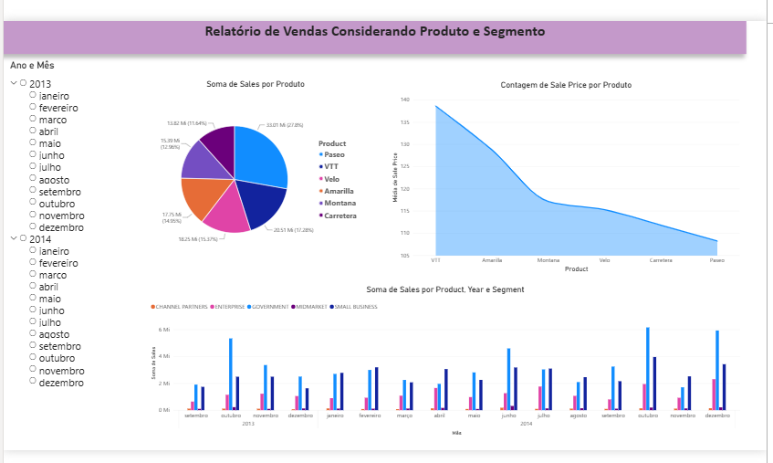
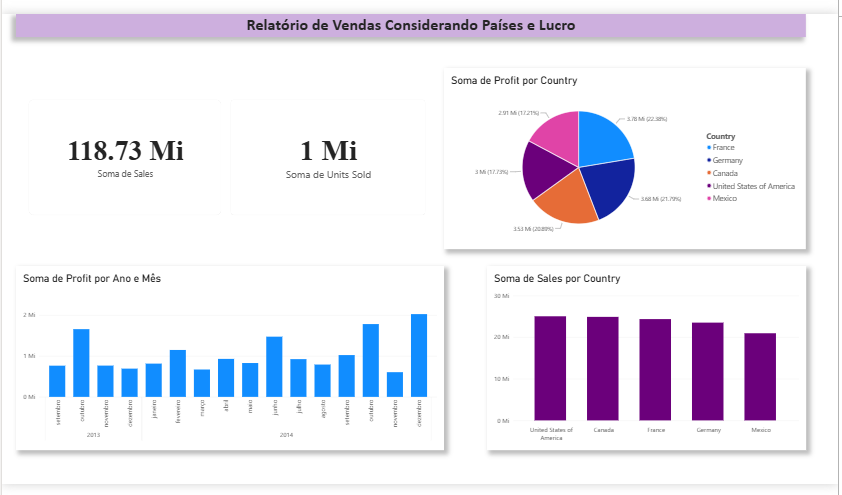
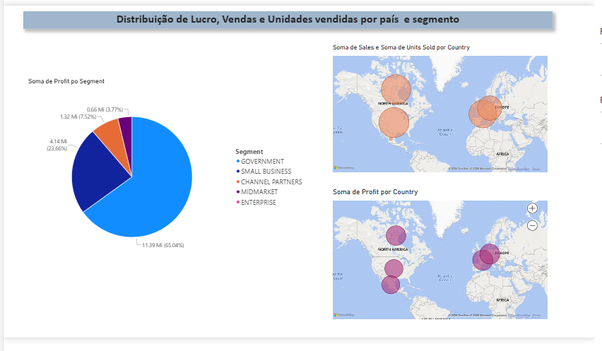

# Analisando dados de um Dashboard de Vendas no Power BI

Projeto desenvolvido como parte do desafio da DIO, com o objetivo de praticar a criação e organização de dashboards no Power BI.

## Sobre o projeto

O relatório foi desenvolvido utilizando o Financials Sample do Power BI.

Foram criadas três páginas de análise, utilizando diferentes tipos de visualizações para apresentar informações de vendas, lucro, produtos, países e segmentos.

## Visualizações utilizadas

- Gráfico de pizza
- Gráfico de colunas
- Gráfico de linhas
- Mapas
- Cartões
- Segmentação de dados

## Ferramenta utilizada

- Microsoft Power BI

## Arquivo do projeto

O arquivo `.pbix` está disponível neste repositório.

## Objetivo

Praticar a criação de dashboards, organização de visuais e análise de dados utilizando o Power BI.

## Dashboard

### Primeiro Dashboard

### Segundo Dashboard

### Terceiro Dashboard

